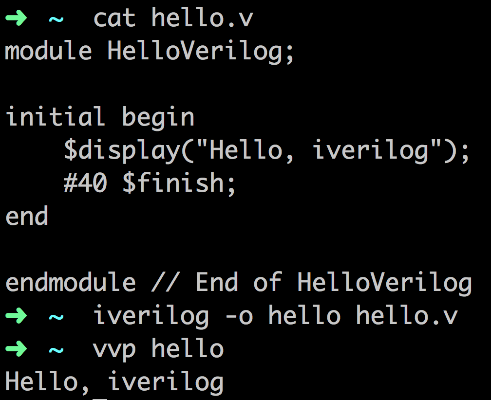

# 開發環境設置

##前言
要開始學會一套語言之前，環境是很重要的部分，如果沒有一個執行環境，沒辦法執行他或是除錯，那麼學得再怎麼好也無用武之地了。因此，本篇將提供一個解決的方案，好用的 Verilog compiler - **[Icarus Verilog](http://iverilog.icarus.com/)**
，讓大家能夠在撰寫完程式碼以後可以編譯執行並測試。

另外，在編寫程式碼的軟體，就各憑喜好，像 hydai 我就特別偏好 `vim` 這套強大的文字編輯工具。對於入門的人或許可以使用好用且容易上手的 `sublime text` 。當然，因為編輯器並不會對程式碼語法造成任何影響，你可以使用任何可編輯文字的工具即可。

在開始使用之前，先來看看 **Icarus Verilog**(以下簡稱 iverilog）有什麼特點：

|  | iverilog |
| :--------------: | :---------------: |
| 編輯器 |  沒有內建編輯器，<br>用自己習慣的編輯器即可  |
| 編譯速度 |  不錯  |
| 錯誤/<br>警告訊息 |  只有檔名行號<br>（還有一句經典的 I give up.）  |
| 個人意見 |  打指令大好  |

至於覺得好不好用，因為是免費的，就還可以接受啦ＸＤ

---
##安裝
###Mac
```bash
brew install icarus-verilog
```
###Ubuntu
```bash
apt-get install verilog
```
###Windows
1. [iverilog-0.9.7.exe(點此下載安裝檔案)](http://bleyer.org/icarus/iverilog-0.9.7_setup.exe)
- 一直按 `next` 到結束，記得在最後一個步驟把加入執行路徑打勾。
- 進入 `cmd` 就可以使用 `iverilog` 和 `vvp` 了。

##如何使用
###Mac / Ubuntu / Windows
####編譯
```bash
# iverilog -o 輸出檔案名稱 輸入的原始碼

iverilog -o datapath datapath.v datapath_t.v
# 上面那行的語法，輸出的檔名叫做 datapath
# 輸入檔為後面接著的 datapath.v datapath_t.v
```

####執行
```bash
# 執行模擬 (run simulation）
# vvp iverilog輸出的檔案名稱
vvp datapath
```

##測試是否安裝完成
###Verilog code
把這裡的程式碼塞到 `hello.v` 裏頭
```Verilog
module HelloVerilog;

initial begin
    $display("Hello, iverilog");
    #40 $finish;
end

endmodule // End of HelloVerilog
```
**編譯＆執行**
```bash
iverilog -o hello hello.v
vvp hello
```
###結果
####Windows

####Mac / Ubuntu


---
現在我們有了 verilog 的編譯器與模擬的環境，接下來就能開工囉！
